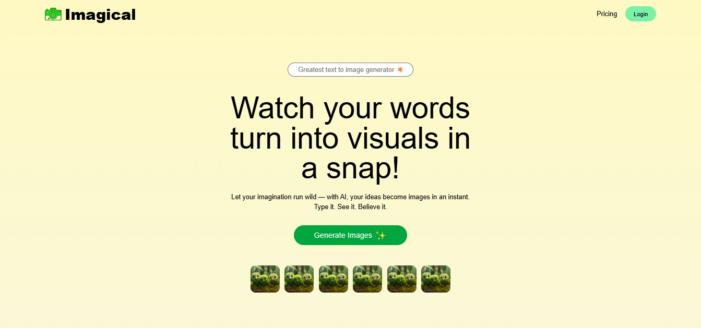
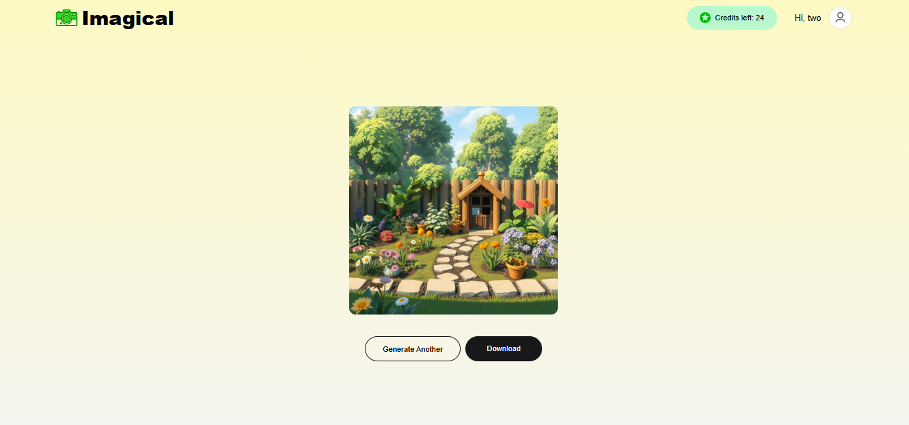

# 🎨 AI Image Generator Web Application

An AI-powered full-stack web application that generates images from text prompts using the ClipDrop API. The app provides a clean, responsive user interface and secure backend APIs for prompt processing, image generation, and session handling.

## 🚀 Features

- Generate AI images from user-provided text prompts
- Secure and efficient RESTful APIs
- Responsive and user-friendly React UI
- Optimized state management for faster interactions
- Reliable API testing and validation using Postman

## 🛠 Tech Stack

**Frontend**
- React.js
- TailwindCSS

**Backend**
- Node.js
- Express.js
- MongoDB

**APIs & Tools**
- ClipDrop API (AI image generation)
- Postman (API testing)

## 📸 Screenshots

### Home Page

### Image Generation Result

## 🧠 How It Works

1. User enters a text prompt in the UI
2. React frontend sends the prompt to the backend API
3. Express server forwards the request to the ClipDrop API
4. Generated image is returned and displayed to the user
5. MongoDB handles user sessions and data storage

